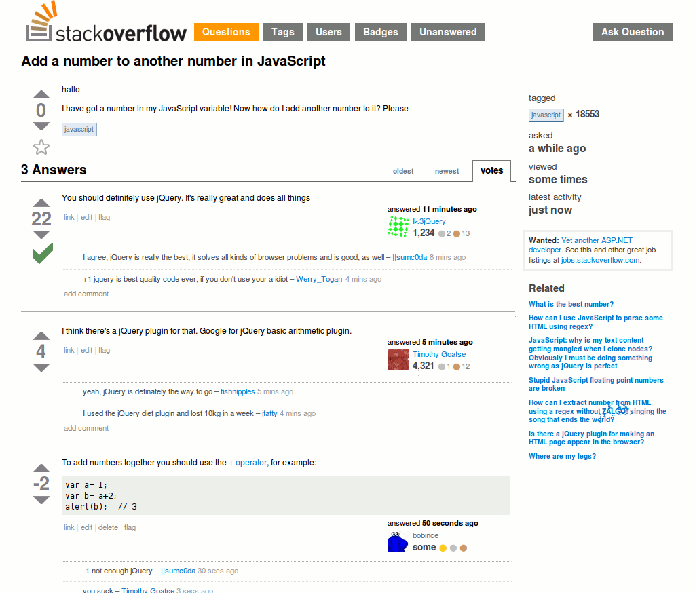

# `SocialForum.com`

According to the mission statement of `SocialForum.com` they are a website that collaboratively administrates empowered markets within the social sector to invigorate public networks. They dynamically integrate C2C users who derive base benefits and can dramatically visualize user directed implementations and growth while disrupting the status quo of the built in system of information technology.

In other words they are the same as about all other online forums. Here are some you may be more familiar with: 

## Imgur
***

## Reddit
***

## StackOverflow
***

 
 

### Core Challenges:

- Users can Post images(via url)/questions/articles
  - The posts are listed without the corresponding comments when they are first rendered
- Users can Add comments
  - When a user selects a post the comments are shown ( think through the UI on how you want this to happen / look )
- Users can sort upvote and downvote any post or comment
    - The page will automatically sort based on the votes, however users can change the sort to be ascending or descending
- When making a post or comment, each user must provide a name

### Extended challenges:
  - Create a search or filter using tags or based on titles of posts
  - Pagenation 
    - only x amount of posts/comments per page
  - Favorite threads
      - users save all their favorites (you can setup users how the sandbox uses them, or save to local storage)