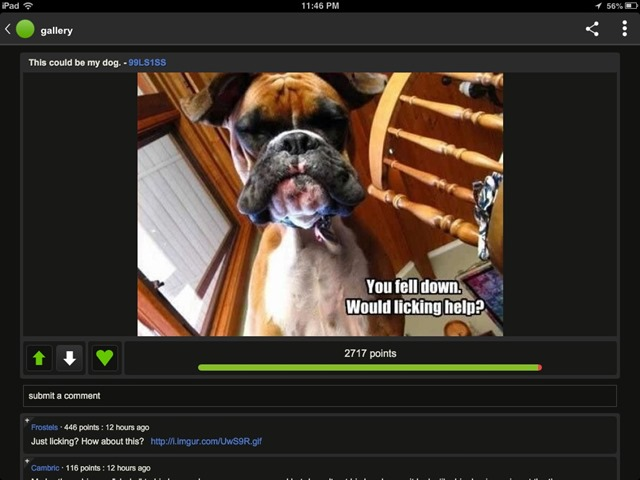

# `SocialForum.com`

According to the mission statement of `SocialForum.com` they are a website that collaboratively administrates empowered markets within the social sector to invigorate public networks. They dynamically integrate C2C users who derive base benefits and can dramatically visualize user directed implementations and growth while disrupting the status quo of the built in system of information technology.

In other words they are the same as about all other online forums. Here are some you may be more familiar with: 

---

#### Imgur

#### Reddit

#### StackOverflow

 
 

---

## Goals

In this challenge students will demonstrate a working knowledge of building full-stack applications in a team environment with tight time deadlines. Groups will utilize a JavaScript front-end implementing the MVC design pattern to demonstrate a knowledge of `DOM` Manipulation. On the server they will use Express with Node.js, the mongoose ORM and MongoDB as their database. The project will also incorporate Authentication using Auth0. Groups will need to create and control data integrity using `one-to-many` relationships to manage users posts and comments.

## The Setup

Before you dive right into the code of this project you will want to take some time to make a few decisions as a team. Some of the things to discuss are: 
-   The primary focus to your project, why your site stands out. (*it's by cats for cats, you can only post gifs, etc...*)
-   Create your product backlog (start with [This](https://trello.com/b/acx10Lks/hackathon))
-   The general theme and design of the site, page, layouts, views, components, etc. (Create a Figma for your site)
-   Identify the relationships and the schemas for the data models

From here you will want to assign one member of the team to create the project on their github and add each of the other team members as collaborators (*settings > manage access > invite collaborators*). This will allow anyone on the team to push and pull from this one github repo (**DO NOT FORK**, *simply clone from the main users repository*). From there, determine which team members will start with the backend and which will start with the front end.

> **TIP:** you should only be coding on 2 computers, one for the client and one for the server. One partner typing and the other partner telling them what to write/researching. Switch who is typing and switch partners periodically throughout the day. All members should see all parts of the project at some point.

## Step 1

After Determining what properties are named and their types, stick with that naming convention. Additionally determine some of the business rules and user stories for your app ("posts must contain a _____ so that _____.")

The server team can start getting to work on creating models, services, and controllers. Meanwhile the front-end team can start to take the mockups that you did earlier and create the skeleton of the client architecture. On the client start by adding fake data statically into arrays within the `AppState`

> Deciding some of the early business rules will be very important your team. The more rules you define, even if they are 'no' rules, (*anyone can post any content they like, you can only delete things you created*) will help in building the application.

---

## Core Challenges:

- [ ] Users can Login/Logout and remain logged in on refresh
- [ ] Users can Post images(via url)/questions/articles
- [ ] The posts are listed without the corresponding comments when they are first rendered
- [ ] Users can Add comments
- [ ] When a user selects a post the comments are shown (*think through the UI on how you want this to happen / look*)
- [ ] The page will automatically sort based on the votes, however users can change the sort to be ascending or descending
- [ ] Users can sort posts by content (*date, popular, controversial*)
- [ ] Only authenticated users can create/edit/delete content
- [ ] When making a post or comment, the server attaches the author
- [ ] Users can upvote or downvote any post or comment

## Extended challenges:
  - Create a search or filter using tags or based on titles of posts
  - Pagination 
    - only x amount of posts/comments per page
  - Favorite threads
      - users save all their favorites (hint: this is a many to many, there are several ways to create this relationship, review your reading)
